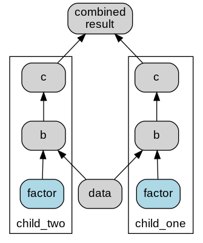

# Usage

## Building up logic

That principle idea behind Fn Graph is to use the names of a functions arguments to find that
functions dependencies, and hence wire up the graph.

There are multiple methods to add functions to the graph, all of them use the underlying
`update` function. In the most direct form update takes keyword arguments, the keyword defines
the name of the function in the graph. For example:

```python
from fn_graph import Composer

def get_a():
    return 5

def get_b(a):
    return a * 5

def get_c(a, b):
    return a * b

composer = Composer().update(a=get_a, b=get_b, c=get_c)
```

Alternatively, some may prefer the more terse version where the function name itself is used as
the name within the graph, for example:

```python
from fn_graph import Composer

def a():
    return 5

def b(a):
    return a * 5

def c(a, b):
    return a * b

composer = Composer().update(a=a, b=b, c=c)
```

The issue with this is it leads to name shadowing, which some people don't like, and many linters
will (rightly) complain about. An alternative that is reasonably terse and does not have the name
shadowing problem is to use the prefix or suffix stripping versions of update.

```python
from fn_graph import Composer

def get_a():
    return 5

def get_b(a):
    return a * 5

def get_c(a, b):
    return a * b

composer = Composer().update_without_prefix("get_", get_a, get_b, get_c)
```

Often you have static inputs into a graph, parameters. It is more convenient ot treat these differently rather than creating functions that just return the values, and use the `update_parameters` method.

```python
from fn_graph import Composer

def get_b(a):
    return a * 5

def get_c(a, b):
    return a * b

composer = (
    Composer()
    .update_without_prefix("get_", get_b, get_c)
    .update_parameters(a=5)
)
```

All update methods return a nw composer, and as such can be safely chained together. You can also update a composer with all the functions of another composer using the `update_from` method.

```python
composer_a = ...

composer_b = ...

composer_c = composer_b.update_from(composer_a)
```

## Visualisation

You can see the function graph using the `graphviz` method. In a notebook environment this will be rendered directly. In other environment you may want to use the view method.

```python
# In a notebbook
composer.graphviz()

#In other environments
composer.graphviz().view()
```

## Calculation

The function graph can be calculated using the `calculate` method. It can calculate multiple results at once, and can return all the intermediate results. It returns a dictionary of the results

```python
composer.calculate(["a" ,"c"]) // {"a": 5, "c": 125}
composer.calculate(["a" ,"c"], intermediates=True) // {"a": 5, "b": 25, "c": 125}
```

You can als use the call function if you want only a single result.

```python
composer.call("c") // 125
```

As an accelerator calling a function is exposed as a method on the composer.

```python
composer.c() // 125
```

## Caching

Caching is provided primarily to make development easier. The development cache will cache results to disk, so it persists between sessions. Additionally it stores a hash of the various functions in the composer, and will invalidate the cache when a change is made. This works well as long as functions are pure, but it does not account for changes in things like data files. you can activate this using the `development_cache` method. The method takes a string name which identifies the cache, often you can just use `__name__`, unless the composer is in the `__main__` script.

```python
cached_composer = composer.development_cache(__name__)
```

If something has changed that requires the cache to be invalidated you can use the `cache_invalidate`
or `cache_clear` methods. `cache_invalidate` takes the names of teh functions you wish to invalidate, it will ensure any follow on functions are invalidated. `cache_clear` will clear the cache.

## Namespaces

When logic gets complex, or similar logic needs to be reused in different spaces in one composer it can useful to use namespaces. Namespaces create a hierarchy of named scopes. that limits what functions arguments resolve to. Namespaces are separated with the double underscore (`__`). Namespaces are constructed using the `update_namespaces` method. For example:

```python
from fn_graph import Composer

def data():
    return 5


def b(data, factor):
    return data * factor


def c(b):
    return b


def combined_result(child_one__c, child_two__c):
    pass


child = Composer().update(b, c)
parent = (
    Composer()
    .update_namespaces(child_one=child, child_two=child)
    .update(data, combined_result)
    .update_parameters(child_one__factor=3, child_two__factor=5)
)
```

Then the resulting graph would look like this:



There are couple of things going on here.

1. You can see that function `c` resolves it's arguments within it;s namespace.
2. The `b` functions do not find a `data` function in their own namespace so they look to the parent namespace.
3. The combined_result specifically names it's argunents to pull from the namespaces using the double-underscore (`__`).
4. The parameters have been set differently in different namespaces (but could have been set the same by putting it in the top level namespace).

These capabilities on their own allow you to construct (and reconstruct) very flexible logic. Sometimes though, given that arguments are resolved just by name it is useful to be able to create a link between one name and another. You can do this using the the `link` method. For example:

```python
def calculated_factor(data):
    return data / 2


factor_calc = Composer()
factoring = Composer().update(calculated_factor)

linked_parent = (
    Composer()
    .update_namespaces(child_one=child, factoring=factoring)
    .update(data)
    .link(child_one__factor="factoring__calculated_factor")
)
```

Which looks like:


The link method gives you flexibility to link between different namespaces, and in general reconfigure your logic without having to write new functions.
